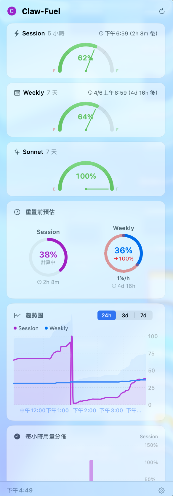

# Claw Fuel

Claude AI 用量監控工具 — 在 macOS 選單列即時追蹤你的 Claude 使用額度。

[English](README.en.md)




## 簡介

Claw Fuel 是一款 macOS 選單列應用程式，讓你隨時掌握 Claude AI 的 API 使用狀況。透過簡潔的選單列圖示與彈出式面板，你可以即時查看剩餘額度、使用趨勢，並在額度即將用盡時收到通知。

## 功能特色

- **選單列即時顯示** — 圖示與百分比一目瞭然，依使用量變色（綠 → 橘 → 紅）
- **多維度額度追蹤** — 同時監控 Session（5 小時）、Weekly（7 天）及 Sonnet Weekly 額度
- **趨勢圖表** — 24 小時 / 3 天 / 7 天歷史用量走勢，搭配面積圖與折線圖
- **用量預測** — 根據目前使用速率，推算額度耗盡時間
- **每小時用量分析** — 柱狀圖呈現每小時用量，標示尖峰時段
- **智慧通知** — 用量達 90% 時發出警告，額度重置時自動提醒
- **開機自動啟動** — 支援 macOS 原生「登入時啟動」
- **雙語支援** — 繁體中文與英文完整在地化

## 系統需求

- macOS 15.0 或以上
- Xcode 16 或以上（編譯用）

## 安裝與使用

1. Clone 此專案：
   ```bash
   git clone https://github.com/anthropics/claw-fuel.git
   ```
2. 用 Xcode 開啟 `claude_usage.xcodeproj`
3. Build & Run（⌘R）
4. 在選單列點擊 Claw Fuel 圖示，點選「連接 Claude」進行登入
5. 登入成功後即自動開始追蹤用量

## 運作原理

1. 透過內建瀏覽器登入 claude.ai，取得認證 Cookie
2. 定期（每 5 分鐘）呼叫 Claude API 取得最新用量資料
3. 解析 Session / Weekly / Sonnet Weekly 三種額度的使用率與重置時間
4. 將歷史用量記錄至本地端，供趨勢圖表與預測功能使用

## 技術架構

| 項目 | 技術 |
|------|------|
| UI 框架 | SwiftUI + MenuBarExtra |
| 圖表 | SwiftUI Charts |
| 認證 | WebKit（WKWebView OAuth 登入） |
| 通知 | UserNotifications |
| 開機啟動 | ServiceManagement |
| 狀態管理 | @Observable（Observation 框架） |

## License

MIT
